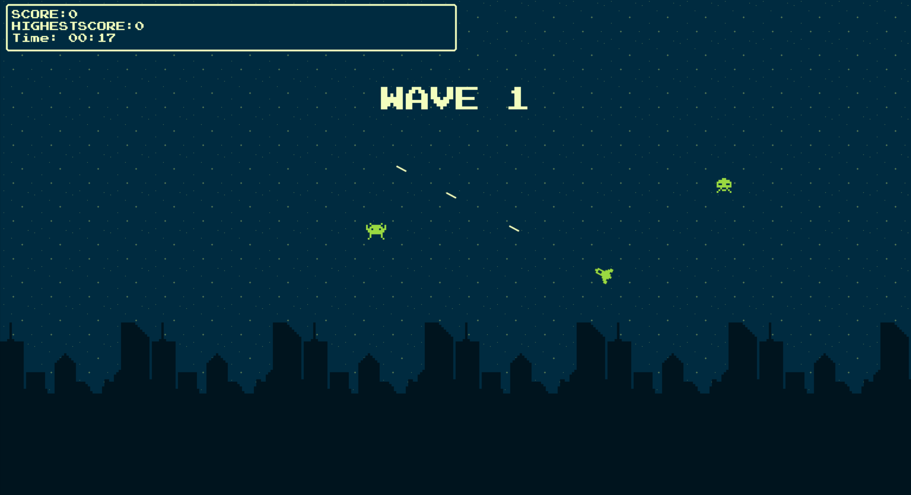
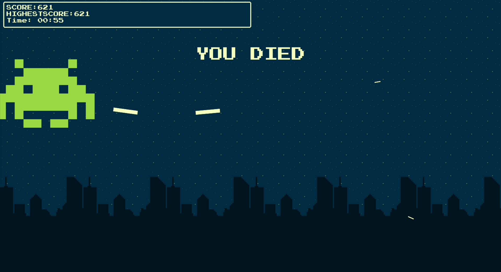
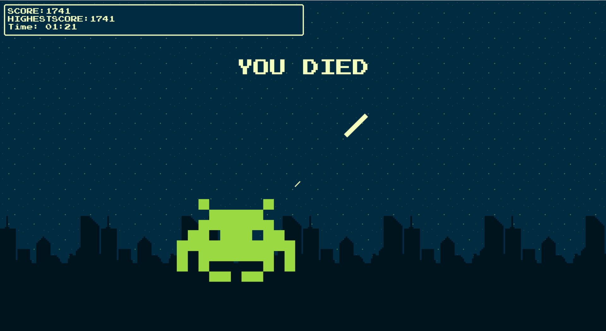

## Installation
Create environment
```bash
py -m venv ./.venv/
```

Install the dependencies
```bash
pip install -r requirements.txt
```

Lauch
```bash
py ./src/main.py
```

## Game Controls
```bash
[ W / A / S / D ] # Movement
[ SPACE ]         # Shoot
[ R ]             # Restart
[ F5 ]            # Show hitbox
[ LMB ]           # On alien shows its type 
```

## Game Screenshots
  

## Limitations
* Game freezes if missiles are too much
* Unoptimized and unmaintainable code